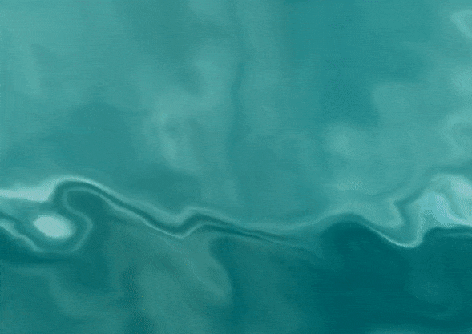

# Water Waves

This is Simple C++ DirectX 8 demo written by myself for testing purpose of water physics.
Just have only one source file, nothing else :)

# Keyboard controls:

* F1-F4 : Change to None, Point, Linear or Anisotropic texture filtration mode;
* F5-F7 : Toggle vertices/wireframe/solid faces;
* F8 : Pause - Continue play;
* F9 : Toggle bright/dark background;
* F11 : Toggle alpha blending;
* Enter : Change fullscreen/windowed.
 
# Build

Requirements
------------

* DirectX 8

Process
-------

1. Create an empty project in Visual Studio C++, 
2. Append main.cpp to that project as main file,
3. Compile and build one.

or

1-3. Browse himself to 'Release' folder and run already been built .EXE.

4. Enjoy.

# AUTHOR
   An0ther0ne, 2005
